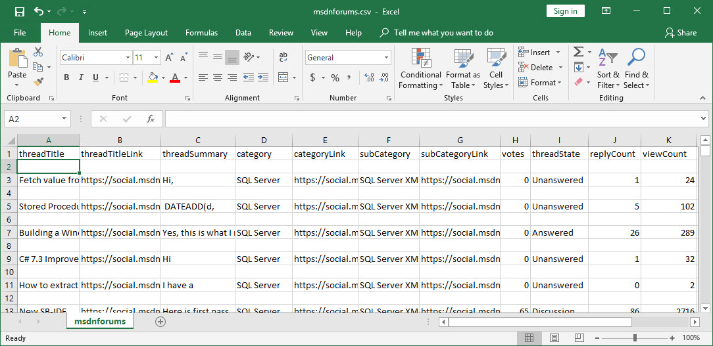

*Due to the number of plots, this page may take a minute to load.*

```{r setup, echo=FALSE, message=FALSE, warning=FALSE}
knitr::opts_chunk$set(echo = TRUE)
```
This project is to analyze the online activities of [Microsoft Developer Network (MSDN) Forums](https://social.msdn.microsoft.com/Forums/en-US/home), as shown below, relevant to the numbers of votes, views and replies. MSDN hosts the online communities for developers to post questions, find answers and exchange ideas relevant to Microsoft and open source products and technologies. 

The goal is to dvelop a model for predicting votes of a discussion thread.


### Scraping Data

I wrote a web scraping program to crawl the site for acquiring relevant data. The code was based on:

- Python 3.6.6
- Scrapy 1.5.1

The site's main data panel displays 20 entries, i.e. disucssion threads, per page. For 10,000 entries on 500 pages which apparently is a hard limit set by the site, the crawl process took about 50 minutes with the following Scrapy settings:

- ROBOTSTXT_OBEY = True
- AUTOTHROTTLE_ENABLED = True
- AUTOTHROTTLE_START_DELAY = 10
- AUTOTHROTTLE_MAX_DELAY = 15

Although on page 500, the next age link remains shown and clickable. when accessing page 501 and beyond, the system consistently presnets an error message and without showing further forum data. The following is a screen capture showing what happened when accessing beyond page 500. Consequently, the number of pages to scrap was hard-coded as 500. 


### Eliminating Blank Lines in the Resulted csv File

The crawl process scraped about 10 MB of data saved in a csv file. The created csv file resulted with a blank line after every data line, as shown below. Before RStudio imported the csv file, a Python routine first had removed all the blank lines.



After eliminating the blank lines, RStudio successfully imported the file. The remining of this article highlights the follow-up effort to explore data, develop a model and examine the results.

```{r echo=FALSE, message=FALSE, warning=FALSE}
rm(list=ls())
setwd('N:/dnd-webscraping/forums/postScraping')

library(dplyr)
#library(mosaic)
library(stringr) # Ref: https://sebastiansauer.github.io/dplyr_filter/
library(plotly)

```

### Importing the Data File

The data frame created was with 10,000 observations of 17 variables. 

```{r echo=TRUE, message=FALSE, warning=FALSE}

# Spider's output
forums <- read.csv(file='msdnforums.csv')

dim(forums)

str(forums) 

sum(is.na(forums)) # Any missing values?

```

And a grand view took first.

```{r echo=FALSE, message=FALSE, warning=FALSE}

plot(forums, col=forums$threadState)

```

### Further Examining and Preparaing Data

The analysis is mainly on the three numberic fields. They are view count, reply count and votes. Other than two with timestamps, those non-essential fields were removed at this time. 

```{r echo=FALSE, message=FALSE, warning=FALSE}
print('Data fields originally scraped')
names(forums) 

# Include only relevant columns
forums <- subset(forums,select=c("category","subCategory","threadState",
         "replyCount","viewCount","votes",
         "createdByTime", "lastReplyTime"))

print('Fields interested and kept')
names(forums)

```

and here were the first 10 rows of the processed dataset at this time.

```{r echo=FALSE, message=FALSE, warning=FALSE}
knitr::kable(forums[1:10,1:8], format="html")
```

### Converting Timestamps

Although this project does not include timeseries analysis, there are two fields with timestamps remain valuable for depicting the distribution of data overtime. The next is to convert these two timestamps:

- **createdByTime**, the time a thread was created
- **lastReplyTime**, the time a reply was posted

into the R datatime format. **There were however some complications.** For those threads created or replied on a current day, the MSDN site used a non-standard data time format. Rather than, e.g.

- "Saturday, October 20, 2018 3:25 PM", 

it recorded something like 

- "Just a few minutes ago" or 
- "4 hours 28 minutes ago" 

as the following:
```{r echo=TRUE}
head(forums$createdByTime)
```

These non-standard representations of timesamps must be converted to a standard date format for R to process.

To correct the problem, rows with these non-standard timestamps were replaced with a utc timestamp. This utc timestamp, as shown below, logged at the web-scraping applicaiton start-time, is placed in the 1st line of the output log for serving as a replacement for those rows with non-standard representations of time.

```{r echo=FALSE, message=FALSE, warning=FALSE}
log <- read.delim(file='msdnforums-forRMDuse.log', header = FALSE)
knitr::kable(log)
```

### Before the timestamp conversion

```{r echo=TRUE, message=FALSE, warning=FALSE}
class(forums$createdByTime)
head(forums$createdByTime)

class(forums$lastReplyTime)
head(forums$lastReplyTime)
```

This utc timestamp in the log file was then read in and used for replacing those non-standard timestamps.

### After the timestamp conversion

```{r echo=FALSE, message=FALSE, warning=FALSE}
# 
forums <- forums %>%
  mutate(createdByTime = as.character(createdByTime)) %>%
  mutate(lastReplyTime = as.character(lastReplyTime))

# A utc timestamp, logged at the web-scraping applicaiton start-time, is
# placed in the 1st line of the output log for serving as a replacement
# for those rows with non-standard representations of time.
ts <- read.table(file="msdnforums.log",nrows=1)

# When an entry is created or updated within the last 24 hours,
# non-standard representations of time indicating how many minutes ago,
# as shown here.
forums$createdByTime[str_detect(forums$createdByTime, "minutes ago$")] = ts
head(forums$createdByTime)

forums$lastReplyTime[str_detect(forums$lastReplyTime, "minutes ago$")] = ts
head(forums$lastReplyTime)

# Convert to standard datatime format
forums <- forums %>%
  mutate(createdByTime = as.Date(as.character(createdByTime), '%A, %B %d, %Y %I:%M %p' )) %>%
  mutate(lastReplyTime = as.Date(as.character(lastReplyTime), '%A, %B %d, %Y %I:%M %p' ))

```

```{r echo=FALSE, message=FALSE, warning=FALSE, eval = FALSE}
### After the timestamp conversion
# NAs, why???
class(forums$createdByTime)
head(forums$createdByTime)

class(forums$lastReplyTime)
head(forums$lastReplyTime)
```

Now the data was prepared and ready.

## Exploratory Data Analysis

An overview of the prepared dataset was the following.

```{r echo=FALSE, message=FALSE, warning=FALSE}

plot(forums, col=forums$threadState)

```

- The apparent linear relationship with a 45-degree straight line between createdByTime and lastReplyTime was trivial, since for every thread, initially the thread creation time and last reply time would always be the same, and the first a few replies would also near the thread cretion time.
- For this project, the categorical fields were not considered.
- The corelation between viewCount and votes seemed a possible candidate for a linera regression mode.

First, reviewed the distribution of individual data fields overtime. The following plots are interactive and click the magify glass icon on top menu bar of the plot to zoom in for details of an observation. 

```{r echo=FALSE, message=FALSE, warning=FALSE}

# right

p1 <-  plot_ly( y=log(forums$viewCount), type = "box", color = ~forums$threadState, 
               colors = c('#BF382A', '#0C4B8E'), boxpoints = "all",  
               marker = list( opacity = 0.5,
                        line = list(color = '#262424',width = 1))) %>% 
      layout(title = 'Overall Thread State Distribution',
#             xaxis = list(type='threadState'),
             yaxis = list(title = 'log(ViewCount)')) 
p1
p2 <-  plot_ly( y=log(forums$replyCount), type = "box", color = ~forums$threadState, 
               colors = c('#BF382A', '#0C4B8E'), boxpoints = "all",  
               marker = list( opacity = 0.5,
                        line = list(color = '#262424',width = 1))) %>% 
      layout(title = 'Overall Replies Distribution',
#             xaxis = list(type='threadState'),
             yaxis = list(title = 'log(replyCount)'))
p2
p3 <-  plot_ly( y=log(forums$votes), type = "box", color = ~forums$threadState, 
               colors = c('#BF382A', '#0C4B8E'), boxpoints = "all",  
               marker = list( opacity = 0.5,
                        line = list(color = '#262424',width = 1))) %>% 
      layout(title = 'Overall Votes Distribution',
#             xaxis = list(type='threadState'),
             yaxis = list(title = 'log(votes)'))
#p3
p4 <-  plot_ly( y=log(forums$viewCount), type = "box", color = ~forums$threadState, 
               colors = c('#BF382A', '#0C4B8E'), boxpoints = "all",  
               marker = list( opacity = 0.5,
                        line = list(color = '#262424',width = 1))) %>% 
      layout(title = 'Overall Views Distribution',
#             xaxis = list(type='threadState'),
             yaxis = list(title = 'log(viewCount)'))
p4

p50 <-  plot_ly( x=forums$category, y=log(forums$viewCount), type = "box", 
                 color = ~forums$threadState, 
                 marker = list( opacity = 0.5,
                                line = list(color = '#262424',width = 1))
                 )  %>%
  layout(title = 'Views vs. Product Category',
#             xaxis = list(type='threadState'),
             yaxis = list(title = 'log(viewCount)'))
p50

p51 <-  plot_ly( x=forums$subCategory, y=log(forums$viewCount), type = "box", 
                 color = ~forums$threadState, 
                 marker = list( opacity = 0.5,
                                line = list(color = '#262424',width = 1))
                 )  %>%
  layout(title = 'Views vs. Product Subcategory',
#             xaxis = list(type='threadState'),
             yaxis = list(title = 'log(viewCount)'))
p51

p6 <-  plot_ly(x=forums$createdByTime, y=log(forums$viewCount), type = "scatter", 
               color = ~forums$threadState, colors = c('#BF382A', '#0C4B8E'), 
               marker = list( opacity = 0.5,
                              line = list(color = '#262424',width = 1))) %>%
  layout(title = 'Views Overtime',
         xaxis = list(type='date'),
         yaxis = list(title = 'Views'))
p6

p7 <-  plot_ly(x=forums$createdByTime, y=log(forums$replyCount), type = "scatter", 
               color = ~forums$threadState, colors = c('#BF382A', '#0C4B8E'), 
               marker = list( opacity = 0.5,
                              line = list(color = '#262424',width = 1))) %>%
  layout(title = 'Replies Overtime',
         xaxis = list(type='date'),
         yaxis = list(title = 'Replies'))
p7

p8 <-  plot_ly(x=forums$createdByTime, y=log(forums$votes), type = "scatter", 
               color = ~forums$threadState, colors = c('#BF382A', '#0C4B8E'), 
               marker = list( opacity = 0.5,
                              line = list(color = '#262424',width = 1))) %>% 
  layout(title = 'Votes Overtime',
         xaxis = list(type='date'),
         yaxis = list(title = 'Votes'))
p8

#,rangeslider = list()

```

One thing I've found interesting is that historically there seemed little evidence with churns of activities influenced by product announcements, releases, product end-of-life, cyber attacks, etc.

## Realizing Correlation

```{r echo=FALSE, message=FALSE, warning=FALSE}
# All three
vcrcv = subset(forums, select=(c('viewCount','replyCount','votes', 'threadState')))
#Creating a view density variable.
vcrcv[,4] = (vcrcv$viewCount)/vcrcv$votes
colnames(vcrcv)[4] = "viewCount/votes"
summary(vcrcv)
cat('Standard Deviation ',sapply(vcrcv, sd))
cor(vcrcv)

```

The correlation between among the three is expected. 

```{r echo=FALSE, message=FALSE, warning=FALSE}
plot(vcrcv, col=forums$threadState)
```

Took a closer view on:

- viewCount and replyCount
- viewCount and votes
- replyCount and votes
- All three together

### viewCount and replyCount

```{r echo=FALSE, message=FALSE, warning=FALSE}

# viewCount and replyCount
vcrc = subset(forums, select=(c('viewCount','replyCount', 'threadState')))

plotvcrc <- plot_ly(vcrc, x=log(vcrc$viewCount),y=log(vcrc$replyCount),
      #       type='scatter', mode='lines',
             color = ~threadState, colors = c('#BF382A', '#0C4B8E'), 
               marker = list( opacity = 0.5,
                              line = list(color = '#262424',width = 1))) %>%
  layout(title ='replyCount vs. viewCount',
         xaxis = list(title='log-viewCount'),
         yaxis = list(title='log-replyCount'))
plotvcrc

```

### viewCount and votes

```{r echo=FALSE, message=FALSE, warning=FALSE}
# viewCount and votes
vcv = subset(forums, select=(c('viewCount','votes','threadState')))

plotvcv <- plot_ly(vcv, x=log(vcv$viewCount),y=log(vcv$votes),
             #       type='scatter', mode='lines',
             color = ~threadState, colors = c('#BF382A', '#0C4B8E')) %>%
  layout(title ='votes vs. viewCount',
         xaxis = list(title='log-viewCount'),
         yaxis = list(title='log-votes'))
plotvcv

```

### replyCount and replyCount

A linear relationship seemed apparaent.

```{r echo=FALSE, message=FALSE, warning=FALSE}
# replyCount and votes
rcv = subset(forums, select=(c('replyCount','votes','threadState')))

plotrcv <- plot_ly(rcv, x=log(rcv$replyCount),y=log(rcv$votes),
                   #       type='scatter', mode='lines',
                   color = ~threadState, colors = c('#BF382A', '#0C4B8E'), 
               marker = list( opacity = 0.5,
                              line = list(color = '#262424',width = 1))) %>%
  layout(title ='votes vs. replyCount',
         xaxis = list(title='log-replyCount'),
         yaxis = list(title='log-votes'))
plotrcv
```

### View All in 3D

Move the cursor to the blank area and click as needed, if the plot does not display itself autotmatically. Drag to rotate and zoom in for details of custered observations.

```{r echo=FALSE, message=FALSE, warning=FALSE}

forums$threadState[which(forums$threadState == 1)] <- 'Answered'
forums$threadState[which(forums$threadstate == 2)] <- 'Proposed'
forums$threadState[which(forums$threadstate == 3)] <- 'Unanswered'
forums$threadState[which(forums$threadstate == 4)] <- 'Discussion'
forums$threadState <- as.factor(forums$threadState)

p3d <- plot_ly(forums,
             y = ~log(replyCount), x = ~log(viewCount), z = ~log(votes),
             color = ~threadState, colors = c('#BF382A', '#0C4B8E'),
             marker = list( opacity = 0.5, 
                  line = list(color = '#262424',width = 1))) %>%
          layout(scene = list(
            xaxis = list(title = 'log-viewCount(x)'),
            yaxis = list(title = 'log-replyCount(y)'),
            zaxis = list(title = 'log-votes(z)')))

p3d

```
The blue ones were those threadss with no or few replies, and similarily few or no votes, despite they might had had a few views. They all clustered near the edge where replyCount and votes cordinate orgins interset.

Considering log-vireCount as x axis and log-votes as the y axis, the distribution of these observations indicated apparent lineraity.

## Considering Multiple Linear Regression

The intent here is to investigate how a multiple linear regression model may fit.

```{r echo=FALSE, message=FALSE, warning=FALSE}
vc <- forums$viewCount
v  <- forums$votes

```

### Considering
$$\hat{votes} = \beta~0 + \beta~1 * viewCount + \beta~2 * replyCount$$

Here's how this model looked:

```{r echo=FALSE, message=FALSE, warning=FALSE}

vcrcv = subset(forums, select=(c('viewCount','replyCount','votes', 'threadState')))

vc200 <- forums$viewCount[0:200]
rc200 <- forums$replyCount[0:200]
v200  <- forums$votes[0:200]

vc1000 <- forums$viewCount[0:1000]
rc1000 <- forums$replyCount[0:1000]
v1000  <- forums$votes[0:1000]

vc2000 <- forums$viewCount[0:2000]
rc2000 <- forums$replyCount[0:2000]
v2000  <- forums$votes[0:2000]

vc <- forums$viewCount
rc <- forums$replyCount
v  <- forums$votes

```

### Start with the first 200 observations

```{r echo=FALSE, message=FALSE, warning=FALSE}
fit200 = lm( v200 ~ vc200 + rc200, data = vcrcv)
summary(fit200)
#cat('Confidence Interval ',confint(fit200))
summary(fit200)$coefficients

#print(c('beta0',summary(fit200)$coefficients[1,1]))
#print(c('beta1',summary(fit200)$coefficients[2,1]))

```


```{r}
qqnorm(fit200$residuals)
qqline(fit200$residuals)
plot(fit200)
#influencePlot(fit1000)
```

### Take the first 1000 observations

```{r echo=FALSE, message=FALSE, warning=FALSE}
fit1000 = lm( v1000 ~ vc1000 + rc1000, data = vcrcv)
summary(fit1000)
#cat('Confidence Interval ',confint(fit1000))
summary(fit1000)$coefficients

#print(c('beta0',summary(fit200)$coefficients[1,1]))
#print(c('beta1',summary(fit200)$coefficients[2,1]))

```


```{r echo=FALSE, message=FALSE, warning=FALSE}
qqnorm(fit1000$residuals)
qqline(fit1000$residuals)
plot(fit1000)
#influencePlot(fit1000)
```


### Consider the first 2000 observations

```{r echo=FALSE, message=FALSE, warning=FALSE}
fit2000 = lm( v2000 ~ vc2000 + rc2000, data = vcrcv)
summary(fit2000)
#cat('Confidence Interval ',confint(fit2000))
summary(fit2000)$coefficients

#print(c('beta0',summary(fit2000)$coefficients[1,1]))
#print(c('beta1',summary(fit2000)$coefficients[2,1]))

```


```{r echo=FALSE, message=FALSE, warning=FALSE}
qqnorm(fit2000$residuals)
qqline(fit2000$residuals)
plot(fit2000)
```

### Take all observations

```{r echo=FALSE, message=FALSE, warning=FALSE}
fitall = lm( v ~ vc + rc, data = vcrcv)
summary(fitall)
#cat('Confidence Interval ',confint(fitall))
summary(fitall)$coefficients

#print(c('beta0',summary(fitall)$coefficients[1,1]))
#print(c('beta1',summary(fitall)$coefficients[2,1]))

```


```{r echo=FALSE, message=FALSE, warning=FALSE}
qqnorm(log(fitall$residuals))
qqline(log(fitall$residuals))
plot(fitall)
```

```{r echo=FALSE, message=FALSE, warning=FALSE, eval = FALSE}
#install.packages('forecast')
library(forecast)
lambda = BoxCox( FITvvc )
lambda = BoxCox.lambda( vector )
# now to transform vector
trans.vector = BoxCox( vector, lambda)

## boxCox
library(MASS)
bc = boxCox(FITvvc)
lambda = bc$x[which(bc$y == max(bc$y))]
vc.bc = (vcrcv$viewCount^lambda - 1)/lambda 
FITvvc.bc = lm(vc.bc ~ vcrcv$votes)
summary(vc.bc)

```

## Another Diagnostic (Under investigation)

```{r echo=FALSE, message=FALSE, warning=FALSE}
#The following plots are taking code from

#Still looking into the code at this time.

# ref: https://moderndata.plot.ly/regression-diagnostic-plots-using-r-and-plotly/

# All three
vcrcv = subset(forums, select=(c('viewCount','replyCount','votes', 'threadState')))

vc200 <- forums$viewCount[0:200]
rc200 <- forums$replyCount[0:200]
v200  <- forums$votes[0:200]

RegressionPlots <- function(fit){
  
  # Extract fitted values from lm() object
  Fitted.Values <-  fitted(fit)
  
  # Extract residuals from lm() object
  Residuals <-  resid(fit)
  
  # Extract standardized residuals from lm() object
  Standardized.Residuals <- MASS::stdres(fit)  
  
  # Extract fitted values for lm() object
  Theoretical.Quantiles <- qqnorm(Residuals, plot.it = F)$x
  
  # Square root of abs(residuals)
  Root.Residuals <- sqrt(abs(Standardized.Residuals))
  
  # Calculate Leverage
  Leverage <- lm.influence(fit)$hat
  
  # Create data frame 
  # Will be used as input to plot_ly
  
  regMat <- data.frame(Fitted.Values, 
                       Residuals, 
                       Standardized.Residuals, 
                       Theoretical.Quantiles,
                       Root.Residuals,
                       Leverage)
  
  # Plot using Plotly
  
  # Fitted vs Residuals
  # For scatter plot smoother
  LOESS1 <- loess.smooth(Fitted.Values, Residuals)
  
  plt1 <- regMat %>% 
    plot_ly(x = Fitted.Values, y = Residuals, 
            type = "scatter", mode = "markers", hoverinfo = "x+y", name = "Data",
            marker = list(size = 10, opacity = 0.5), showlegend = F) %>% 
    
    add_trace(x = LOESS1$x, y = LOESS1$y, type = "scatter", mode = "line", name = "Smooth")  %>% 
    
    layout(title = "Residuals vs. Fitted Values", plot_bgcolor = "#f7f7f7")
    
  # QQ Pot
  plt2 <- regMat %>% 
    plot_ly(x = Theoretical.Quantiles, y = Standardized.Residuals, 
            type = "scatter", mode = "markers", hoverinfo = "x+y", name = "Data",
            marker = list(size = 10, opacity = 0.5), showlegend = F) %>% 
    
    add_trace(x = Theoretical.Quantiles, y = Theoretical.Quantiles, type = "scatter", mode = "line", name = "",
              line = list(width = 2)) %>% 
    
    layout(title = "Q-Q Plot", plot_bgcolor = "#f7f7f7")
  
  # Scale Location
  # For scatter plot smoother
  LOESS2 <- loess.smooth(Fitted.Values, Root.Residuals)
  
  plt3 <- regMat %>% 
    plot_ly(x = Fitted.Values, y = Root.Residuals, 
            type = "scatter", mode = "markers", hoverinfo = "x+y", name = "Data",
            marker = list(size = 10, opacity = 0.5), showlegend = F) %>% 
    
    add_trace(x = LOESS2$x, y = LOESS2$y, type = "scatter", mode = "line", name = "Smooth",
              line = list(width = 2)) %>% 
    
    layout(title = "Scale Location(?)", plot_bgcolor = "#f7f7f7")
  
  # Residuals vs Leverage
  # For scatter plot smoother
  LOESS3 <- loess.smooth(Leverage, Residuals)
  
  plt4 <- regMat %>% 
    plot_ly(x = Leverage, y = Residuals, 
            type = "scatter", mode = "markers", hoverinfo = "x+y", name = "Data",
            marker = list(size = 10, opacity = 0.5), showlegend = F) %>% 
    
    add_trace(x = LOESS3$x, y = LOESS3$y, type = "scatter", mode = "line", name = "Smooth",
              line = list(width = 2)) %>% 
    
    layout(title = "Leverage vs. Residuals", plot_bgcolor = "#f7f7f7")
  
  plt = list(plt1, plt2, plt3, plt4)
  return(plt)
}

fit200_ = lm( v200 ~ vc200 + rc200 , data = vcrcv)
	
pfit200  = RegressionPlots(fit200_)

pfit200
```

